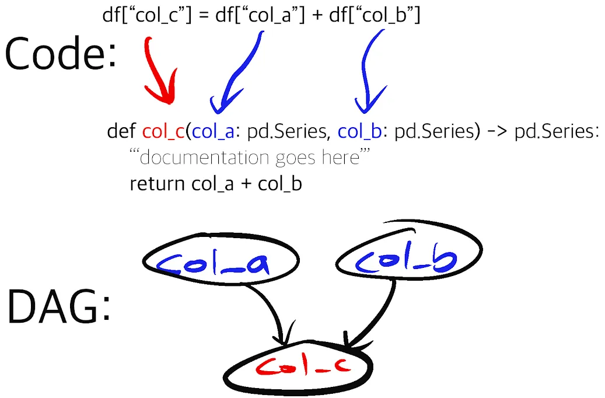
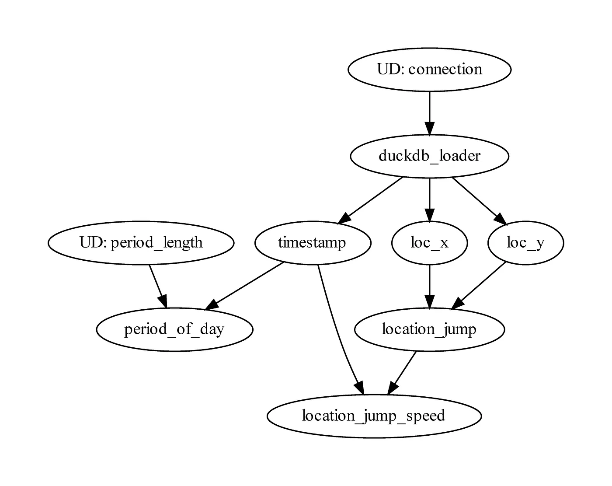

[Hamilton](https://github.com/stitchfix/hamilton) is an open-source Python microframework developed at [Stitch Fix](https://www.stitchfix.com/). It automagically organizes Python functions into a *directed acyclic graph* (DAG) from their name and type annotations. It was originally created to facilitate working with tabular datasets containing hundreds of columns, but it’s general enough to enable many data science or machine learning (ML) scenarios.

> crosspost from https://medium.com/@thijean/the-perks-of-creating-dataflows-with-hamilton-36e8c56dd2a

<!--truncate-->

Over the last year, I used Hamilton both in academic research to build forecast models from smartphone sensor data, and in industry to implement dynamic bidding strategies for an ad exchange. Amongst a sea of awesome open-source tools, Hamilton happened to neatly suit my needs. Below, I will give a brief overview of Hamilton, and break down what I believe to be its key strengths:

1. Improve code readability
2. Facilitate reproducible pipelines
3. Enable faster iteration cycles
4. Reduce the development-production gap

To learn more about the design and the development of the framework, the [Stitch Fix’s engineering blog](https://multithreaded.stitchfix.com/blog/) is a gold mine.

## Quick introduction to Hamilton

Hamilton relies on 3 main components: the *functions*, the *driver*, and the *desired outputs*.

*Functions* are your regular Python functions, but each needs to have a unique name and type annotated inputs and outputs, and be defined within a Python module (.py file).

One or more modules are passed to the *driver* along a configuration object. The driver builds a DAG by linking a function’s arguments (named and annotated) to other functions’ name. At this point, no computation has happened yet.



Finally, a list of *desired outputs*, which can be any node from the graph, is passed to the driver. When *executed*, the driver computes the desired output by running only the necessary functions. By default, Hamilton outputs pandas dataframe, but it can also return a dictionary containing arbitrary objects.

## Suggested development workflow
My preferred development workflow relies on opening side-to-side a Python module and a Jupyter notebook with the [%autoreload ipython magic](https://ipython.org/ipython-doc/3/config/extensions/autoreload.html) configured (code snippet below). I write my data transformation in the module, and in the notebook, I instantiate a Hamilton driver and test the DAG with a small subset of data. Because of `%autoreload`, the module is reimported with the latest changes each time the Hamilton DAG is executed. This approach prevents out-of-order notebook executions, and functions always reside in clean .py files.

```python title="Jupyter notebook autoreload
from hamilton.driver import Driver
import my_module  # data transformation module

%load_ext autoreload   # load extension
%autoreload 1  # configure autoreload to only affect specified files
%aimport my_module  # specify my_module to be reloaded

hamilton_driver = Driver({}, my_module)
hamilton_driver.execute(['desired_output1', 'desired_output2'])
```

## Improve code readability
> Zen of Python #7: Readability counts

Code readability is multifaceted, but can be summarized to making code easy to understand for colleagues, reviewers, and your future self. You may think that your pandas operations are self-evident, or that writing a separate function for 1–3 lines of numpy code is overkill, **but you’re likely wrong**.

```python title="Hamilton ABC
import pandas as pd

def avg_3wk_spend(spend: pd.Series) -> pd.Series:
    """Rolling 3 week average spend."""
    return spend.rolling(3).mean()

def spend_per_signup(spend: pd.Series, signups: pd.Series) -> pd.Series:
    """The cost per signup in relation to spend."""
    return spend / signups
```

Simply by requiring unique function names and type annotations, Hamilton pushes developers to divide the pipeline into steps that each hold their own **intent**. It generates a **semantic layer** that is decoupled from the data transformation implementation. In the above example, the name `avg_3wk_spend` and the docstring communicate a clear intent compared to the pandas code `spend.rolling(3).mean()` (note that the time unit couldn’t be inferred!) Communicating the intent or the business purpose of a function helps understand the broader pipeline, but also allows collaborators to improve or replace a given implementation while preserving the intent.

Breaking down complex functions into simpler single-purpose functions has many other benefits. For one, abstracting repetitive or redundant operations makes your code [DRY](https://en.wikipedia.org/wiki/Don%27t_repeat_yourself)-er and easier to unit test and debug. Also, meaningful results become more clearly separated from intermediary transformations. Utility functions to view the computation graph diagram can be helpful during the development process.


## Facilitate reproducible pipeline
Both in academia and in industry, data science and ML projects generate a myriad of results and artifacts. *Experiment tracking* typically refers to the systematic and organized tracking of those artifacts. It’s most often discussed in the context of ML training and hyperparameter optimization, leaving out data transformation pipelines despite their influence on the former.

With Hamilton, the end-to-end transformations can be tracked from a few parameters. Since the Hamilton DAG is built in a deterministic manner, it doesn’t have to be logged; only the functions it’s built need to. No large artifacts have to be created! When running experiments with your favorite tool (MLFlow, Weights&biases, etc.), simply log the Hamilton **driver configuration** and the **Git SHA1** of your python modules. To go a step further, you can store a **picture of the executed DAG** and track the **package version** in case of future behavior change.

```python title="Visualize the DAG
from hamilton.driver import Driver

import time_transform
import location_transform

if __name__ == "__main__":
    config = dict(connection={"database": ":memory:"})  # required driver config
    hamilton_driver = Driver(config, time_transform, location_transform)

    # view the complete computation DAG
    hamilton_driver.display_all_functions("./file.dot", {})
    # view only the path to the specified outputs
    hamilton_driver.visualize_execution(["period_of_day", "location_jump_speed"], "./file.dot", {})
```



## Enable faster iteration cycles
Many “DAG-based” frameworks (Airflow, Metaflow, flyte, Prefect, etc.) are gaining traction in the data science and ML community. However, most are intended for orchestration, which is broader than the data transformation problem Hamilton aims to solve. It remains non-trivial to identify frameworks that align with your needs, have a simple, clear and well-documented API, require minimal [glue code](https://en.wikipedia.org/wiki/Glue_code), and are easy to move away from.

Orchestration frameworks rely on first defining processing steps, and then manually connecting them into a DAG. Connections have to be specified through decorators, classes, functions, or even YAML configuration files. Such approach imposes mental burden on data scientists and forces them to rewrite the DAG every time they want to investigate a new hypothesis. The problem only worsens as a project scales in complexity. Because this process is error-prone, a lot of time can be spent wrestling with the framework. Automatically building the DAG can lead to productivity improvements.

Relying on regular Python functions, Hamilton requires minimal refactoring to get started (a [robust migration](https://hamilton-docs.gitbook.io/docs/best-practices/migrating-to-hamilton) guide is available). This allows adopters to make “quick wins” and eases the onboarding of colleagues. For complex scenarios, powerful features are accessible through function [decorators](https://hamilton-docs.gitbook.io/docs/reference/api-reference/available-decorators). In all cases, your code remains usable outside of Hamilton (minus the decorators).

>**Aside**: On the opposite end of the spectrum, I worked with [Kedro](https://kedro.readthedocs.io/en/stable/) which is a holistic and opinionated framework for data pipelines, and had a positive experience. It can feel restrictive at times, but the built-in conventions and the extensive set of tools it provides (i.e., configuration, versioning, tests, notebooks, etc.) does improve team productivity and solution robustness.

## Reduce the development-production gap
While Hamilton is a great framework for iterations, how does it fair in production? It might work for Stitch Fix, but can it handle my specific business use case? Is it computationally efficient? The TL;DR. is yes!

In Hamilton, the driver receives the DAG instructions and later executes the computation. Originally, it relied on the pandas library to calculate new columns, which can [become inefficient at scale](https://pandas.pydata.org/docs/user_guide/scale.html). An exciting addition was the release of [Spark, Dask, and Ray](https://multithreaded.stitchfix.com/blog/2022/02/22/scaling-hamilton/) drivers. Now, pandas data transformation can be executed by the Hamilton Dask driver and get the performance increase for free. It allows data scientists to define and test functions locally, and move to production without refactoring. What’s not to love!

Recently, [data validation](https://multithreaded.stitchfix.com/blog/2022/07/26/hamilton-data-quality/) at the node level and support for the [pandera](https://pandera.readthedocs.io/en/stable/) library (another great lightweight package!) were added. The development team is actively improving integration with open source tools. For advanced users, it’s possible to extend the framework’s standard interfaces (driver, decorator, result builder, etc.) to meet your requirements. People at Stitch Fix are very responsive and eager to help through [GitHub issues](https://github.com/stitchfix/hamilton/issues) and their [Slack channel](https://join.slack.com/t/hamilton-opensource/shared_invite/zt-1bjs72asx-wcUTgH7q7QX1igiQ5bbdcg).

## Conclusion
Hamilton is a great tool for data scientists and ML folks. I hope the overview provided convinced you to give it a try. You’re only `pip install sf-hamilton` away from getting started!

References:

1. Hamilton GitHub page (2022), https://github.com/stitchfix/hamilton
2. Stich Fix engineering blog (2022), https://multithreaded.stitchfix.com/engineering/